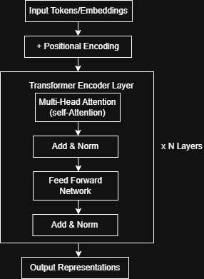

# Edge AI ML Systems - Phase 1

## Project Overview

This project implements an end-to-end ML systems pipeline using CNN and Transformer models from scratch. 

The focus is on system-level understanding including training workflows, performance benchmarking, profiling, and analyzing computational tradeoffs between different model architectures. 

## Phase 1 Objectives

- Implement CNN training pipeline
- Implement Transformer Encoder from scratch
- Profile training performance
- Benchmark CNN vs Transformer

## System Pipeline

## Phase 2 - Deployment Pipeline
PyTorch → ONNX → Runtime → Quantization → Edge Deployment

## Repository Structure

edgeai-ml-systems-phase1/

models/  
&nbsp;&nbsp;&nbsp;&nbsp;cnn.py  
&nbsp;&nbsp;&nbsp;&nbsp;transformer.py 

training/  
&nbsp;&nbsp;&nbsp;&nbsp;train.py 

utils/  
&nbsp;&nbsp;&nbsp;&nbsp;dataset.py  

configs/  
&nbsp;&nbsp;&nbsp;&nbsp;cnn.yaml

benchmarks/  
&nbsp;&nbsp;&nbsp;&nbsp;benchmark.py

docs/  
&nbsp;&nbsp;&nbsp;&nbsp;system_pipeline1.png  
&nbsp;&nbsp;&nbsp;&nbsp;transformer_encoder1.png

README.md  
requirements.txt

## CNN Architecture
The implemented CNN architecture follows this pipeline:

Input (1x28x28)

Conv2d (1 → 16, kernel=3, padding=1)  
ReLU  
MaxPool (2×2)

Conv2d (16 → 32, kernel=3, padding=1)  
ReLU  
MaxPool (2×2)

Flatten

Fully Connected (1568 → 128)  
ReLU

Fully Connected (128 → 10)

Total Parameters: 206,922

## Transformer Encoder Architecture
The Transformer encoder is implemented using multi-head self-attention and feed-forward layers stacked sequentially.

  

## Training Pipeline
The training loop follows a model-agnostic PyTorch workflow applicable to both CNN and Transformer models:  
Forward Pass → Loss Calculation → Backpropagation → Optimizer Update

Components:
- Loss: CrossEntropyLoss
- Optimizer: Adam
- Dataset: MNIST

## CNN vs Transformer Comparison

| Metric | CNN | Transformer |
|------|------|------------|
| Training Time (1 epoch) | 17.36 s | 30.45 s |
| Single Inference Latency | 0.301 ms | 1.302 ms |
| Batch Inference Latency (32) | 1.164 ms | 2.641 ms |
| Parameters | 206,922 | 102,474 |
| Peak Memory Usage | ~335 MB | ~335 MB |
| Best DataLoader Workers | \- | 2 |

## Key Insights

- Transformer models have fewer parameters but higher computational complexity due to attention mechanisms (O(n²)).
- CNN is significantly faster for image-based tasks due to localized convolution operations.
- Transformer shows slower training and inference despite lower parameter count.
- Batch inference reduces the performance gap but CNN remains more efficient.
- Peak memory usage is similar for both models in this setup, indicating that activations and runtime dominate memory usage.
- DataLoader performance depends on system configuration and is independent of model architecture.

## Engineering Learnings

- Parameter count alone does not determine model efficiency.
- Attention mechanisms introduce quadratic complexity with sequence length.
- Profiling tools like cProfile and memory_profiler are essential for identifying bottlenecks.
- Backpropagation is the most computationally expensive step in training.
- Data loading can become a bottleneck without proper tuning.
- Benchmarking should evaluate training, inference, and memory — not just accuracy.

## Highlights

- Built CNN and Transformer models from scratch
- Implemented modular training pipeline with YAML configuration
- Performed system-level benchmarking and profiling
- Compared architectures based on performance, not just accuracy

## Conclusion

This project demonstrates a complete ML systems pipeline including model implementation, training, profiling, and benchmarking.

CNN models are more efficient for image-based tasks due to optimized convolution operations, while Transformer models provide architectural flexibility but introduce higher computational overhead.

This comparison highlights the importance of evaluating machine learning models from a systems perspective rather than relying solely on accuracy or parameter count.

## How to Run
### Create environment
conda create -n edgeai python=3.10  
conda activate edgeai

### Install dependencies
pip install -r requirements.txt

### Train the model

Default (CNN):
python -m training.train

Transformer:
python -m training.train --model_name transformer

### Run benchmarks
python -m benchmarks.benchmark

## Author
C. Sivananda Reddy